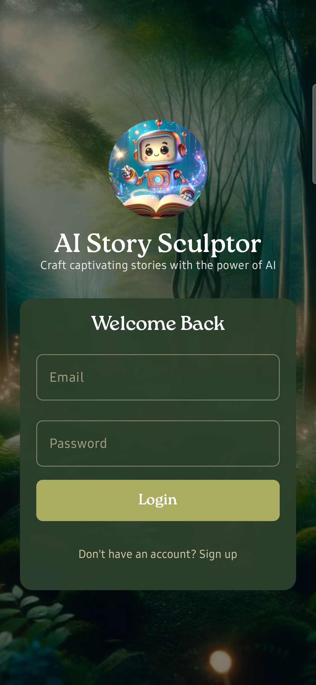

# AI Story Sculptor (Android Native)

[](https://github.com/Monyechi/AI-Story-Sculptor_Android-Native/actions/workflows/android-ci.yml)
[](https://github.com/Monyechi/AI-Story-Sculptor_Android-Native/releases/download/v1.0.0-mvp/AI-Story-Sculptor-v1.0.0-mvp.apk)

Native Android client for the existing Django backend, built with Kotlin + Jetpack Compose.

## Screenshots

<p align="center">
  
</p>

## Tech Stack

- Kotlin + Jetpack Compose (Material 3)
- MVVM + Repository pattern
- Coroutines + Flow
- Retrofit + OkHttp
- Kotlinx Serialization
- Room (offline cache)
- Hilt (dependency injection)
- DataStore (token persistence)
- Navigation Compose

## Architecture

Code is split into:

- `data/` → API, DB, DataStore, repository implementations
- `domain/` → models, repository interfaces, use cases
- `ui/` → screens, viewmodels, navigation, ui state

## Backend Base URL Configuration

Set your API base URL through Gradle properties.

1. Open (or create) `local.properties` at project root.
2. Add:

```properties
BASE_URL=https://your-backend-domain.com/
```

Notes:

- Keep trailing slash (the build script also normalizes it).
- This value is exposed as `BuildConfig.BASE_URL`.
- Do **not** add `OPENAI_API_KEY` to Android `local.properties`; AI provider credentials are backend-only.
- Backend env template for secure secrets: `backend/.env.example`.

## Current Features

- Authentication screens for login and registration with persisted auth token state.
- OkHttp authorization interceptor and 401 refresh authenticator integration in the network stack.
- Library screen backed by Room cache with pull-to-refresh updates from the backend.
- Compose navigation split into authenticated and main flows (Library/Create/Details).
- Story creation flow implemented as a 4-step wizard with submission and generation-status polling.
- Story details screen with metadata, chapter display, and download/share actions.
- Background PDF download via WorkManager and local sharing through FileProvider.

## Django Route Mapping (Phase 3)

Mapped legacy backend routes (see `app/src/main/java/com/monyechi/aistorysculptor/data/api/LegacyDjangoApi.kt`):

- `login/`
- `register/`
- `bookshelf/`
- `create/`
- `book/{bookId}/details/`
- `download/pdf/{bookId}/`
- `download/docx/{bookId}/`

Important:

- Current Django app is mostly session-auth + HTML-rendered endpoints.
- For first-class native support, add JSON API endpoints (DRF recommended) for auth/library/create/details/status.

## Mobile-First API Interface (Next)

The app now targets a dedicated mobile contract (`/api/v1/mobile/...`) instead of web-template endpoints.

- Contract spec: `docs/MOBILE_API_CONTRACT.md`
- Android Retrofit interfaces aligned to this contract in `app/src/main/java/com/monyechi/aistorysculptor/data/api/ApiServices.kt`
- Mobile request/response DTOs in `app/src/main/java/com/monyechi/aistorysculptor/data/api/MobileApiDtos.kt`
- Legacy web/session route map in `app/src/main/java/com/monyechi/aistorysculptor/data/api/LegacyDjangoApi.kt` for reference only

## Known Limitations

- The backend must expose the documented mobile JSON contract (`/api/v1/mobile/...`) for full compatibility.
- Legacy Django session/HTML routes are retained for reference and are not the target integration path for this client.
- Features that depend on backend job lifecycle data (generation progress/status timing) are limited by backend endpoint behavior.

## Roadmap

- Complete and verify end-to-end backend parity for all mobile contract endpoints in production environments.
- Improve reliability and UX around long-running generation jobs and status polling.
- Expand automated testing coverage across networking, persistence, and key user flows.

## Run

1. Open this folder in Android Studio.
2. Sync Gradle.
3. Configure `BASE_URL`.
4. Run app on emulator/device.


## Testing

Run deterministic unit tests (ViewModels, use cases, and repository boundaries):

```bash
./gradlew testDebugUnitTest
```

Expected output:

- `BUILD SUCCESSFUL`
- Unit tests including `AuthViewModelTest`, `CreateBookViewModelTest`, and `RepositoryBoundaryUseCaseTest` pass.

Run smoke instrumentation test (register/login + create-book happy path):

```bash
./gradlew connectedDebugAndroidTest
```

Expected output:

- `BUILD SUCCESSFUL`
- `AuthAndCreateBookSmokeTest` passes on a connected emulator/device.
